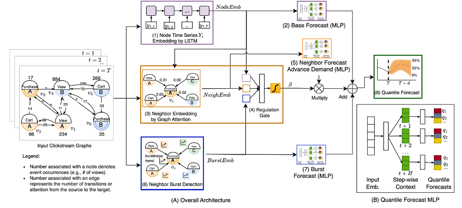

# Let Clickstream Talk: A Graph Neural Network Approach to Sales Forecasting

This repository provides the author accepted manuscript of **Let Clickstream Talk: A Graph Neural Network Approach to Sales Forecasting**.

**Authors:** Rong Liu, Zihan Chen, Denghui Zhang, Feng Mai, and Xuying Zhao  
**Journal:** *Production and Operations Management* (2026)  
**DOI:** [10.1177/10591478261490953](https://doi.org/10.1177/10591478261490953)

## Read the paper

- [Let Clickstream Talk: A Graph Neural Network Approach to Sales Forecasting — Accepted Manuscript (PDF)](let-clickstream-talk-a-graph-neural-network-approach-to-sales-forecasting.pdf)
- [Published article on Sage Journals](https://doi.org/10.1177/10591478261490953)

The paper introduces ForecastClickGraph, a graph neural network framework that uses clickstream data to model cross-product relationships and forecast sales, including demand bursts.

### ForecastClickGraph: A Cross-learning Framework for Multi-step Probabilistic Forecasts



*Framework overview. ForecastClickGraph combines time-series embeddings, graph-attention-based neighbor information, and demand-burst signals to produce multi-step probabilistic sales forecasts. The right panel shows the quantile forecasting module.*

## Manuscript version

The PDF in this repository is the author accepted manuscript supplied by the authors. It contains the manuscript and appendices in author-prepared formatting. It is not the publisher's copyedited and typeset version of record. Refer to the DOI above for the published article and any subsequent corrections or updates.

## Citation

Liu, R., Chen, Z., Zhang, D., Mai, F., & Zhao, X. (2026). Let clickstream talk: A graph neural network approach to sales forecasting. *Production and Operations Management, 0*(0). https://doi.org/10.1177/10591478261490953

```bibtex
@article{liu2026clickstream,
  title   = {Let Clickstream Talk: A Graph Neural Network Approach to Sales Forecasting},
  author  = {Liu, Rong and Chen, Zihan and Zhang, Denghui and Mai, Feng and Zhao, Xuying},
  journal = {Production and Operations Management},
  year    = {2026},
  volume  = {0},
  number  = {0},
  publisher={SAGE Publications Sage CA: Los Angeles, CA},
  doi     = {10.1177/10591478261490953},
  url     = {https://doi.org/10.1177/10591478261490953}
}
```

## Copyright and reuse

Copyright © 2026 The Author(s).

This accepted manuscript is shared free of charge under [Sage's author archiving and re-use guidelines](https://www.sagepub.com/journals/permissions/sages-author-archiving-and-re-use-guidelines), subject to the applicable publication agreement.

- **Permitted posting:** Authors may share accepted manuscripts after acceptance on websites or in repositories.
- **Non-commercial use:** The manuscript is provided for non-commercial research purposes.
- **No derivatives:** Reuse is restricted to no-derivative uses. This sharing permission does not authorize modified, adapted, or translated versions.
- **Attribution:** Retain the authors' names, copyright notice, and full available journal citation, including the DOI.
- **Republication:** Republishing or translating any version in another journal requires prior permission from Sage.
- **Publisher PDF:** Posting the final publisher PDF on an unrestricted website or repository requires Sage's permission.

Uses outside these terms require appropriate permission. These terms do not override exceptions or limitations provided by applicable law. This repository does not grant a Creative Commons or software license.
